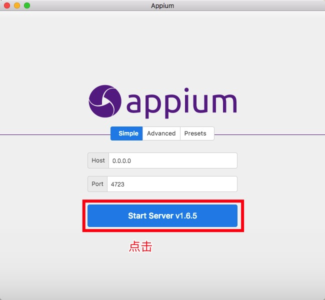
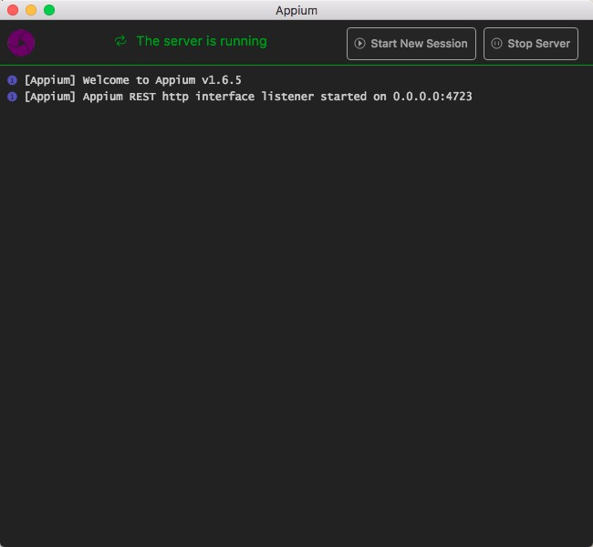

# AppUI 自动化框架入门使用01 - Appium 简单入门使用

## 1 Appium 简单入门使用
本篇文章是基于你的 Appium 环境搭建好的前提进行的，如 Appium 环境没搭建好，请先进行 Appium 环境搭建。一个简单的Appium 测试例子，包括以下几部分：启动 Appium Server、创建 AppiumDriver、对特定的元素进行操作

### 1.1 Appium 原理浅谈

#### 1.1.1 Client/Server
Appium server 是一个 Client/Server 的结构。在电脑中通过命令启动一个 Server 端，监听一个端口，将 client 发送来的命令（就是我们手动写的代码），将这些命令翻译转换成移动设备（Android 和 iOS）能识别的命令发送到底层的框架中，底层框架得到这些命令将其发送到所测试的设备上执行这些命令。
执行命令后，将执行结果返回到底层框架，底层框架再返回到 Appium Server，Appium 再将执行结果返回到 client。

#### 1.1.2 Session
session 就是一个会话，在一次测试中，只能用一个 session，所有的测试操作，都是基于这个 session。多设备运行，就是一个 session 对应一个设备。

### 1.2 Appium 的 DesiredCapabilities 参数配置
具体的 DesiredCapabilities 参数请查看：[Appium参数全集](https://github.com/appium/appium/blob/master/docs/cn/writing-running-appium/caps.md)

#### 1.2.1 公共常用参数
1. `deviceName`，设备名称或模拟器类型；
2. `platformName`，使用的手机操作系统；
3. `platformVersion`，手机操作系统的版本；
4. `udid`，连接真机的唯一设备号；
5. `automationName`，自动化测试的引擎；
6. `app`，本地绝对路径_或_远程 http URL 所指向的一个安装包（.ipa,.apk,或 .zip 文件）。

#### 1.2.2 Android 常用参数
1. `appPackage`，运行的 Android 应用的包名；
2. `appActivity`，Activity 的名字是指从你的包中所要启动的 Android Acticity；
3. `unicodeKeyboard`，使用 Unicode 输入法，支持中文输入；
4. `resetKeyboard`，Unicode 测试结束后，重置输入法到原有状态。

#### 1.2.3 iOS 常用参数
1. `bundleId`，被测应用的 bundle ID；
2. `xcodeOrgId`，真机测试 Apple ID 的 Team ID；
3. `xcodeSigningId`，Apple ID 类型，一般为`iPhone Developer`；

### 1.3 元素抓取
详细请查看另外2篇关于 Appiun 定位的文章。定位到一个元素后，写入到代码中，即可完成元素操作。

### 1.4 一个简单的 Appium 例子的完成
一个简单的Appium 测试例子，包括以下几部分：启动 Appium Server、创建 AppiumDriver、对特定的元素进行操作

#### 1.4.1 启动 Appium Server
启动 Appium Server 的方式主要有3种：

1. 使用命令行版本的 Appium 启动，方式是在终端直接输入命令 `Appium` 即可。看到以下截图文案，则说明启动成功。

    

2. 使用 Appium 客户端 【Appium Desktop】启动。<br>
    打开 Appium Desktop 客户端，并点击 Start Server 按钮。如下图所示

    

    如果见到以下截图，则说明完成启动。

    

3. 在代码中自动启动 Appium Server，这种方法也是最推荐使用的，自动化的完成度是最高的，无需人工手动干预 Appium Server 的运行状态。推荐使用这种，框架封装启动 Appium Server的也是这种

```
AppiumDriverLocalService service = AppiumDriverLocalService.buildDefaultService();
# 在 before方法初始化 driver 之前，需启动 server
service.start();
# 在 after 方法中最后，需加上下面这句代码
service.stop();
```

#### 1.4.2 创建 AppiumDriver
在测试类的 setup 方法中增加以下代码

```
DesiredCapabilities capabilities = new DesiredCapabilities();
capabilities.setCapability(MobileCapabilityType.DEVICE_NAME, "suiyi");
capabilities.setCapability(MobileCapabilityType.PLATFORM_NAME, "Android");
capabilities.setCapability(MobileCapabilityType.PLATFORM_VERSION, "7.0");
capabilities.setCapability(MobileCapabilityType.UDID,"EJL4C17212003456");
capabilities.setCapability(MobileCapabilityType.APP, "/the/test/app/path/in/your/computer");
capabilities.setCapability(MobileCapabilityType.AUTOMATION_NAME, AutomationName.ANDROID_UIAUTOMATOR2);
capabilities.setCapability(AndroidMobileCapabilityType.APP_PACKAGE, "com.babychat");
capabilities.setCapability(AndroidMobileCapabilityType.APP_ACTIVITY,"com.babychat.activity.WelcomeActivity");
capabilities.setCapability(MobileCapabilityType.NO_RESET, true);

AppiumDriver<MobileElement> driver = new AndroidDriver<>("http://127.0.0.1:4723/wd/hub", capabilities);
```

在 tearDown 方法中增加以下代码：

```
driver.quit();
```

#### 1.4.3 元素操作
具体怎么定位元素，请查找我之前写的元素定位文章吧。

#### 1.4.4 一个完整的 Appium 例子
上面三点说完，就可以整出一个完整的例子

```
package appium;

import io.appium.java_client.MobileElement;
import io.appium.java_client.android.AndroidDriver;
import io.appium.java_client.remote.AndroidMobileCapabilityType;
import io.appium.java_client.remote.AutomationName;
import io.appium.java_client.remote.MobileCapabilityType;
import io.appium.java_client.service.local.AppiumDriverLocalService;
import io.appium.java_client.service.local.AppiumServiceBuilder;
import org.openqa.selenium.remote.DesiredCapabilities;
import org.testng.annotations.AfterClass;
import org.testng.annotations.BeforeClass;
import org.testng.annotations.Test;

import java.io.File;

public class AppiumSimpleTest {

    private AndroidDriver<MobileElement> driver;
    private AppiumDriverLocalService service ;

    @BeforeClass
    public void setUp() throws Exception {
        DesiredCapabilities capabilities = new DesiredCapabilities();
        capabilities.setCapability(MobileCapabilityType.DEVICE_NAME, "suiyi");
        capabilities.setCapability(MobileCapabilityType.PLATFORM_NAME, "Android");
        capabilities.setCapability(MobileCapabilityType.PLATFORM_VERSION, "7.0");
        capabilities.setCapability(MobileCapabilityType.UDID,"EJL4C17212003456");
        capabilities.setCapability(MobileCapabilityType.APP, "/Users/gaojiewen/Downloads/beiliao/parent_4_6_0_prepublish.apk");
        capabilities.setCapability(MobileCapabilityType.AUTOMATION_NAME, AutomationName.ANDROID_UIAUTOMATOR2);
        capabilities.setCapability(AndroidMobileCapabilityType.APP_PACKAGE, "com.babychat");
        capabilities.setCapability(AndroidMobileCapabilityType.APP_ACTIVITY,"com.babychat.activity.WelcomeActivity");
        capabilities.setCapability(MobileCapabilityType.NO_RESET, true);

        AppiumServiceBuilder serviceBuilder = new AppiumServiceBuilder();
        //如果使用的是 Windows 系统，则需要相应的修改 appium 中的 main.js文件的路径
        serviceBuilder
                .withAppiumJS(new File("/usr/local/lib/node_modules/appium/build/lib/main.js"))
                .withIPAddress("127.0.0.1")
                .usingAnyFreePort()
                .withCapabilities(capabilities);
        service = AppiumDriverLocalService.buildService(serviceBuilder);
        service.start();

        driver = new AndroidDriver<>(service.getUrl(), capabilities);
    }

    @Test
    public void testName() throws Exception {
        Thread.sleep(5000);
        driver.findElement(MobileBy.AndroidUIAutomator("new UiSelector().className(\"android.widget.EditText\").focused(true)")).sendKeys("15015015015");
        driver.findElement(MobileBy.AndroidUIAutomator("new UiSelector().className(\"android.widget.EditText\").focused(false)")).sendKeys("123456");
        driver.findElement(MobileBy.id("com.babychat:id/btn_login")).click();
        Thread.sleep(5000);
    }

    @AfterClass
    public void tearDown() throws Exception {
        driver.quit();
        service.stop();
    }
}
```


