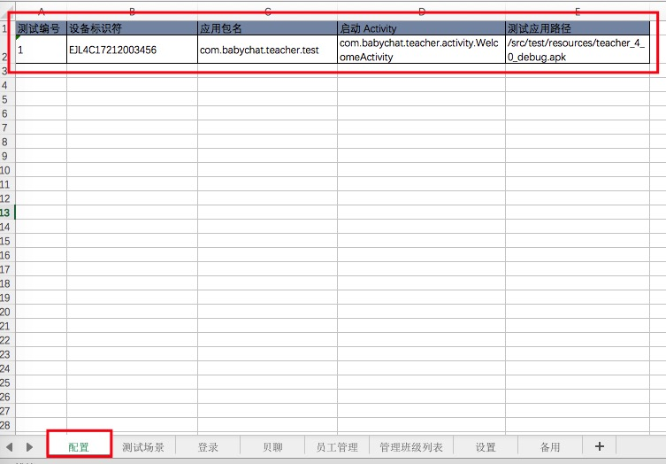
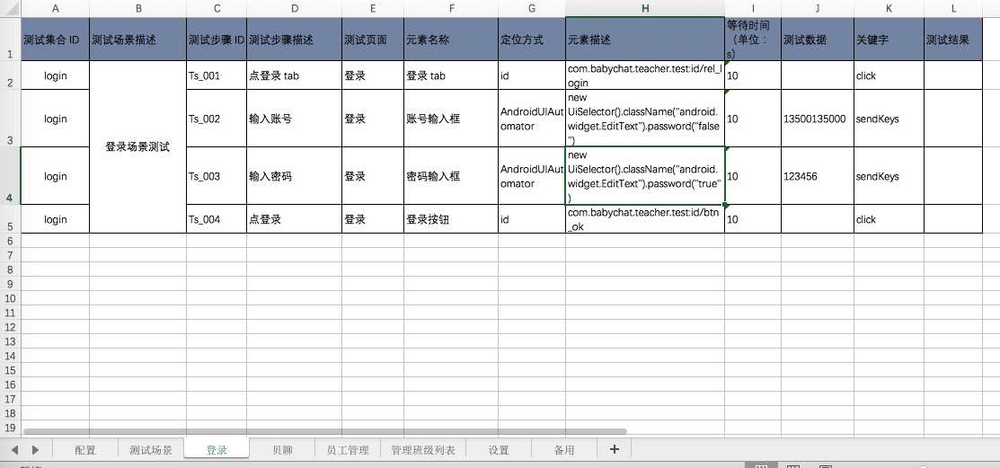
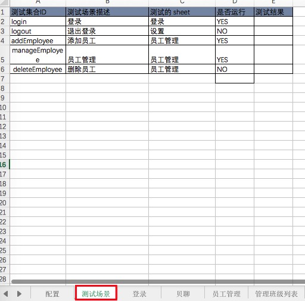

# AppUI 自动化框架入门使用02 - Excel 测试用例文档编写规范

## 2 Excel 测试用例文档编写
Appium Excel 的测试用例文档编写主要分为三大部分：测试设备和测试应用的配置、测试集合的运行配置、测试元素及流程的编写

### 2.1 测试设备和测试应用的配置
在 sheet【配置】中编写测试设备编号、设备标识符（udid）、测试应用路径、应用包名、应用的主 Activity（Android 需配置，iOS 不用）。如下图所示：



### 2.2 测试流程中元素的定位信息编写
1. 新建一个 sheet，sheet 名最好跟当前测试流程相关的文案，而且尽可能简洁。这个 sheet 名同样需要放到sheet【测试场景】和代码的测试类中。

2. 按照以下截图新建模板
    
    ```
    测试集合 ID：识别当前测试业务流程的单词，整个业务流程均使用同一个值。必须与本 sheet 中其他业务流程区分开，与其他 sheet 的业务流程区分开（非必须）
    测试场景描述：业务流程的简单描述
    测试步骤 ID：区分业务流程的顺序
    测试步骤描述：测试元素操作的简单描述
    测试页面：测试元素所在的页面
    元素名称：测试元素的名称
    定位方式：测试元素的定位方式，此为选择框，选择模板支持的定位方式
    元素描述：测试元素决定定位方式后的定位信息
    等待时间：测试元素的等待时间，默认为10s
    测试数据：输入框等测试元素需要的测试数据，点击或其他不需要测试数据的元素，可为空
    关键字：决定测试元素操作的关键字（调用方法的名称）
    测试结果：此元素经过测试后，返回的一个测试结果
    ```




### 2.3 测试集合的运行配置
一个业务流程编写完成后，需在 sheet【测试场景】填写上该业务流程的相关信息，如下面截图所示。

```
测试集合 ID：与测试的 sheet 的测试集合 ID 的值一致
测试场景描述：与测试的 sheet 的
测试的 sheet：测试的 sheet 名
是否运行：运行时，判断是否运行该业务流程。值为：YES 或者 NO。
测试结果：整个业务流程的测试结果
```




